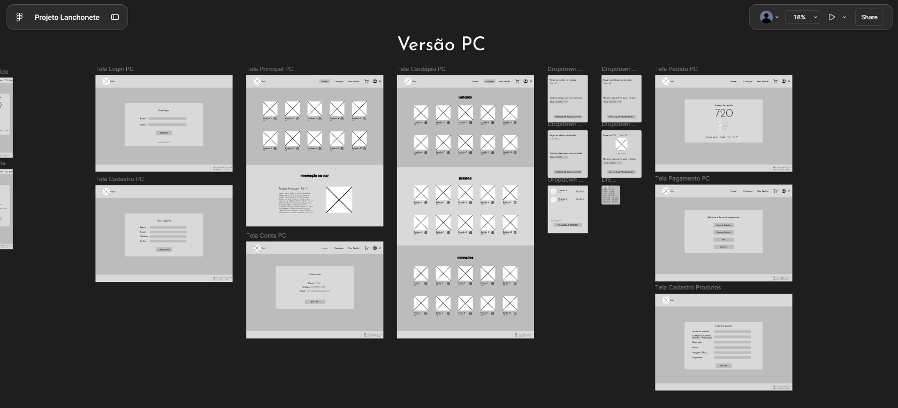

# Projeto de interface

Pré-requisitos: <a href="03-Product-design.md"> product design</a>

 Visão geral da interação do usuário pelas telas do sistema e protótipo interativo das telas com as funcionalidades que fazem parte do sistema (wireframes).

## Wireframes

### Protótipo Interativo

[Protótipo interativo](https://www.figma.com/design/eWkzD1V8LKrg2dL2TZO7Rx/Projeto-Lanchonete?node-id=0-1&t=LVnf01HGcuFVYers-1)
