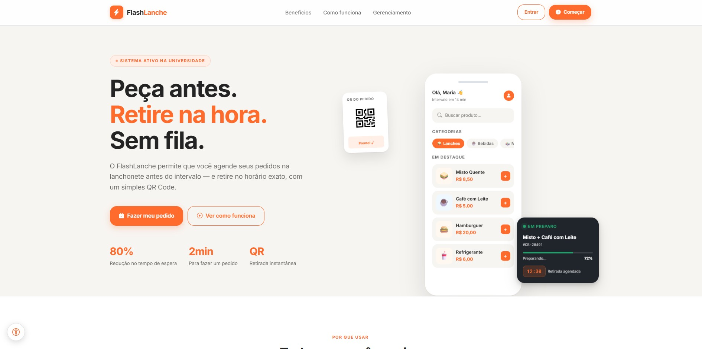

# Template padrão da aplicação

## 1. Visão geral do template

O FlashLanche adota um layout padrão consistente em todas as páginas, dividido em dois "shells" (invólucros) visuais conforme o perfil de acesso:

- **Shell do Cliente/Home**: cabeçalho fixo no topo (`top-nav`/`header`) com logo à esquerda e ações de navegação/autenticação à direita, seguido pelo conteúdo da página, com o widget flutuante de acessibilidade (TTS) no canto inferior.
- **Shell do Gerente**: layout de painel administrativo (`manager-layout`), com sidebar de navegação fixa à esquerda (recolhível) e área de conteúdo à direita, contendo uma barra superior (`top-bar`) com título da página e ações contextuais.

Ambos os shells compartilham a mesma paleta de cores, tipografia, iconografia e tokens de espaçamento/sombra, garantindo uma identidade visual única em toda a aplicação — a distinção visual entre "loja" e "painel administrativo" é proposital, sinalizando ao usuário em qual contexto ele está (consumo vs. gestão).

## 2. Manual da marca

### 2.1 Logotipo

**Composição:** o logo é formado por um selo quadrado de cantos arredondados (`border-radius: 10px`), em laranja sólido, contendo um ícone de raio (`bi-lightning-charge-fill`, Bootstrap Icons) em branco, seguido do nome da marca em texto: **"Flash"** (cor neutra escura) + **"Lanche"** (cor laranja de destaque).

**Significado:** o raio remete a **rapidez** — o pedido é feito, retirado e validado (via QR Code) de forma quase instantânea, sem filas — reforçando a proposta central do produto: um sistema de pedidos ágil para o intervalo escolar. O nome "FlashLanche" une esse conceito de velocidade ("Flash") ao produto oferecido ("Lanche"), e a quebra tipográfica de cor entre as duas partes do nome (neutro + laranja) segmenta visualmente as duas ideias, com o laranja atuando como o elemento de identidade que se repete em botões, ícones e destaques por toda a aplicação.

**Uso correto:**
- O selo sempre deve manter proporção 1:1 (36×36px no cabeçalho principal) com o ícone centralizado.
- A sombra suave em tom laranja (`0 2px 8px rgba(255,107,44,0.32)`) deve acompanhar o selo, reforçando profundidade sem destoar da paleta.
- O texto "Flash" nunca deve ser exibido na cor laranja, e "Lanche" nunca deve ser exibido na cor neutra — a quebra de cor é parte da identidade e não deve ser invertida ou unificada.
- Espaçamento mínimo de 10px entre o selo e o texto deve ser respeitado.

### 2.2 Paleta de cores

| Token | Hex/Valor | Uso |
|---|---|---|
| `--orange` (cor primária) | `#ff6b2c` | Ações primárias, destaque de marca, links ativos |
| `--orange-deep` | `#e4571f` | Estado hover/pressionado de elementos laranja |
| `--orange-soft` | `#ffefe7` | Fundos suaves de destaque (badges, ícones) |
| `--green` | `#22a06b` | Sucesso, confirmações, status positivo (ex.: "Gerente Online", receita) |
| `--yellow` | `#f4b740` | Alertas, status intermediário |
| `--red` | `#d64545` | Erros, ações destrutivas (remover, cancelar) |
| `--blue` | `#4f7cff` | Informações complementares, acentos secundários |
| `--canvas` | `#f7f5f2` | Fundo padrão das páginas (bege claro) |
| `--white` | `#ffffff` | Fundo de cartões e superfícies elevadas |
| `--dash-gray` | `#eef1f5` | Fundo de áreas neutras no painel do gerente |
| `--border-gray` | `#dde2e8` | Bordas e divisores |
| `--dark` | `#20242b` | Fundo da sidebar do gerente e elementos de alto contraste |
| `--text-primary` | `rgba(18,18,18,0.92)` | Texto principal |
| `--text-secondary` | `rgba(18,18,18,0.62)` | Texto de apoio/legendas |

A paleta segue uma lógica clara: **laranja como cor de marca e ação**, **verde/amarelo/vermelho como sistema semântico de status** (sucesso/atenção/erro), e **neutros bege/cinza/escuro** para estrutura e hierarquia, evitando concorrência visual com a cor primária.

### 2.3 Tipografia

- **Fonte principal:** [Inter](https://fonts.google.com/specimen/Inter) (Google Fonts), pesos 400 a 800 — usada em todo o texto de interface (títulos, corpo, botões), por sua alta legibilidade em telas e caráter neutro/moderno.
- **Fonte monoespaçada:** [Roboto Mono](https://fonts.google.com/specimen/Roboto+Mono) — reservada para dados que se beneficiam de alinhamento tabular e leitura precisa: números de pedido, IDs, métricas numéricas em destaque (ex.: número de pedidos, faturamento).
- **Fallback:** `'Helvetica Neue', Arial, sans-serif`, garantindo renderização consistente caso a fonte web não carregue.
- **Escala tipográfica fluida:** títulos usam `clamp()` (ex.: `clamp(26px, 3vw, 36px)` para `h1-text` e `clamp(40px, 6vw, 64px)` para `display-text`), permitindo que o tamanho da fonte se adapte suavemente entre mobile e desktop sem quebras abruptas de layout.

### 2.4 Iconografia

- **Biblioteca:** [Bootstrap Icons](https://icons.getbootstrap.com/) (via CDN), mantendo consistência visual com o framework CSS utilizado no restante do projeto.
- Ícones são usados de forma funcional (não apenas decorativa): reforçam a ação do botão/link (ex.: carrinho, coração para favoritos, seta de saída para logout, layout de sidebar para o toggle do menu), auxiliando o reconhecimento rápido mesmo antes da leitura do texto.
- Ícones em botões de ação sempre acompanham um rótulo textual (nunca usados isoladamente sem contexto), reforçando a acessibilidade.

### 2.5 Elementos gráficos e componentes

- **Cantos arredondados** consistentes: `--r-btn: 18px` para botões, `--r-card: 20px` para cartões — transmitindo uma identidade "amigável"/aproximável, adequada ao público escolar.
- **Sombras em camadas** (`--shadow-low`, `--shadow-mid`, `--shadow-high`, `--shadow-orange`) usadas para hierarquia de elevação: cartões de conteúdo usam sombras neutras suaves, enquanto elementos de destaque/ação (ex.: botão primário, ícone do logo) usam a sombra colorida `--shadow-orange`, reforçando a cor de marca mesmo em elementos com pouco preenchimento colorido.
- **Badges de status** com fundo semitransparente na cor semântica correspondente (verde/amarelo/vermelho), mantendo o texto em sua cor sólida, para contraste e legibilidade.

## 3. Responsividade

O layout responsivo segue três faixas principais de breakpoint, testadas e ajustadas em todas as páginas do sistema:

| Faixa | Largura | Comportamento |
|---|---|---|
| Desktop | > 992px | Layout completo: grid multi-coluna no cardápio/produtos, sidebar do gerente fixa ao lado do conteúdo (modelo "push", encolhendo/expandindo a coluna do grid ao ser ocultada) |
| Tablet/Mobile | ≤ 992px | Sidebar do gerente passa a funcionar como *drawer*: fixa sobre o conteúdo (`position: fixed`), com fundo escurecido (*backdrop*) atrás dela e deslizamento lateral (`transform: translateX`) ao ser ocultada/exibida |
| Mobile pequeno | ≤ 576px/480px | Grids de produtos/pedidos colapsam para 1–2 colunas, formulários e cartões reduzem padding, navbars quebram linha (`flex-wrap`) em vez de cortar conteúdo, modais ganham margem lateral para não tocar as bordas da tela |

Princípios adotados:
- **Mobile-first nos componentes novos**, com uso de `grid-template-columns: repeat(auto-fill, minmax(...))` sempre que possível, permitindo que grids se adaptem automaticamente sem exigir uma media query para cada largura de tela.
- **Tipografia fluida** via `clamp()` nos títulos principais, evitando textos desproporcionais em telas muito pequenas ou muito grandes.
- Elementos flutuantes (widget de TTS, botão de carrinho) reposicionam-se ou se ocultam em telas pequenas para não sobrepor conteúdo essencial.

## 4. Processo de criação

O template foi construído a partir de um sistema de *design tokens* (variáveis CSS em `:root`) definido antes da criação de qualquer componente visual, garantindo que cor, espaçamento, raio de borda e sombra fossem sempre reaproveitados — nunca declarados como valores soltos ("magic numbers") dentro de componentes individuais. Essa abordagem token-first permitiu que, ao longo do desenvolvimento incremental do projeto (novas páginas, novos módulos), a identidade visual permanecesse coesa sem necessidade de retrabalho: qualquer novo componente herda automaticamente a paleta, tipografia e a linguagem de elevação (sombras/raios) já estabelecidas neste documento.

