# Arquitetura da solução

Definição de como o software é estruturado em termos dos componentes que fazem parte da solução e do ambiente de hospedagem da aplicação.


## Funcionalidades

Esta seção apresenta as funcionalidades da solução.

##### Funcionalidade 1 - Login
Permite que um usuário cadastrado (Cliente Comum ou Gerente) se autentique no sistema informando usuário e senha, validados contra o cadastro salvo. Em caso de sucesso, cria a sessão ativa do usuário e adapta a interface (navbar, acesso às páginas) conforme o perfil.
* **Instruções de acesso:**
  * Na página inicial, clique em "Entrar";
  * Informe usuário e senha cadastrados (ex.: `user`/`123` para cliente, `admin`/`123` para gerente);
  * Clique em "Entrar" para confirmar.
* **Tela da funcionalidade**:
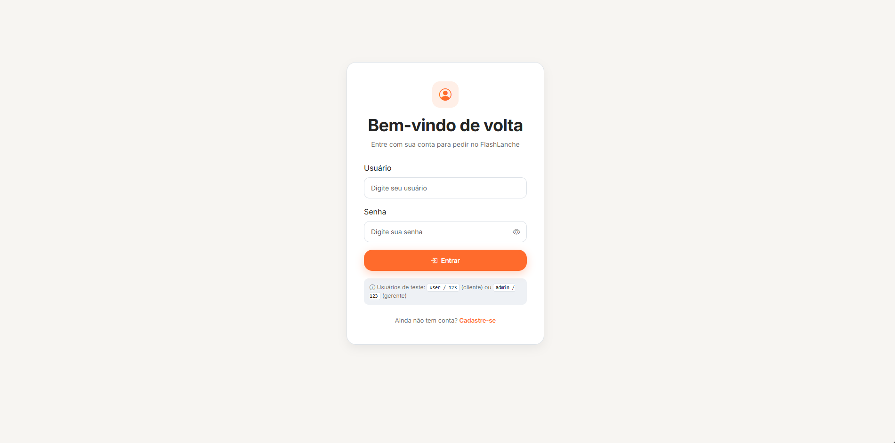

##### Funcionalidade 2 - Cadastro
Permite que um visitante crie uma nova conta de Cliente Comum, informando usuário, e-mail, telefone e senha. Não existe elevação de privilégio (Gerente) pela interface.
* **Instruções de acesso:**
  * Na página inicial, clique em "Começar";
  * Preencha usuário, e-mail, telefone, senha e confirmação de senha;
  * Clique em "Criar conta".
* **Tela da funcionalidade**:
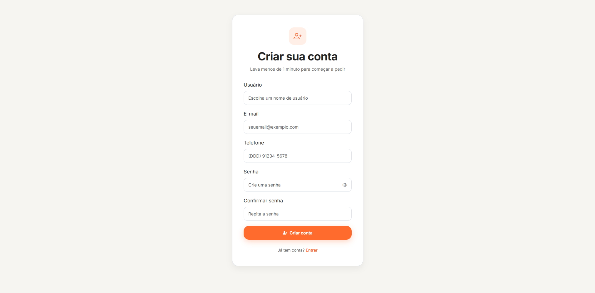

##### Funcionalidade 3 - Cadastro de Produto
Permite ao gerente incluir, alterar e excluir produtos do cardápio (CRUD completo).
* **Instruções de acesso:**
  * Faça login como gerente;
  * Acesse "Produtos" na sidebar do painel;
  * Clique em "Novo Produto" para incluir, ou em um produto existente para editar/excluir.
* **Tela da funcionalidade**:
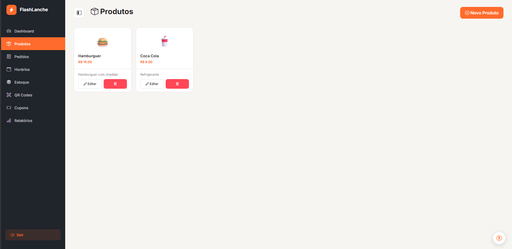

##### Funcionalidade 4 - Apresentação de Produto (Cardápio)
Exibe ao cliente os produtos disponíveis no cardápio, com informações de nome, descrição, preço, imagem e disponibilidade em estoque.
* **Instruções de acesso:**
  * Faça login como cliente;
  * Acesse "Cardápio" pela navbar.
* **Tela da funcionalidade**:
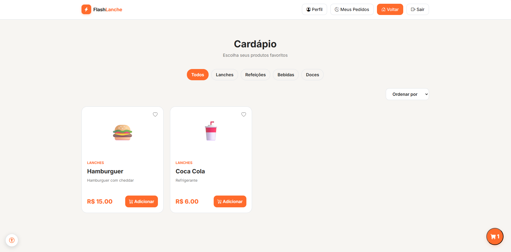

##### Funcionalidade 5 - Funcionalidade Geral do Carrinho
Permite adicionar produtos ao carrinho, alterar quantidades, remover itens e aplicar cupom de desconto. O carrinho é individual por usuário.
* **Instruções de acesso:**
  * No cardápio, clique em "Adicionar ao carrinho" no produto desejado;
  * Acesse o carrinho pelo ícone flutuante no canto da tela;
  * Ajuste quantidades, remova itens ou aplique um código de cupom.
* **Tela da funcionalidade**:
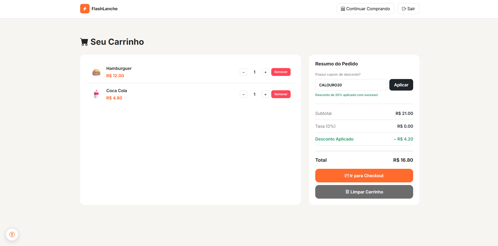

##### Funcionalidade 6 - Cadastro de Horários
Permite ao gerente incluir, alterar e excluir horários de retirada, definindo a capacidade (vagas) de cada um.
* **Instruções de acesso:**
  * Faça login como gerente;
  * Acesse "Horários" na sidebar do painel;
  * Cadastre, edite ou remova um horário informando hora e capacidade.
* **Tela da funcionalidade**:
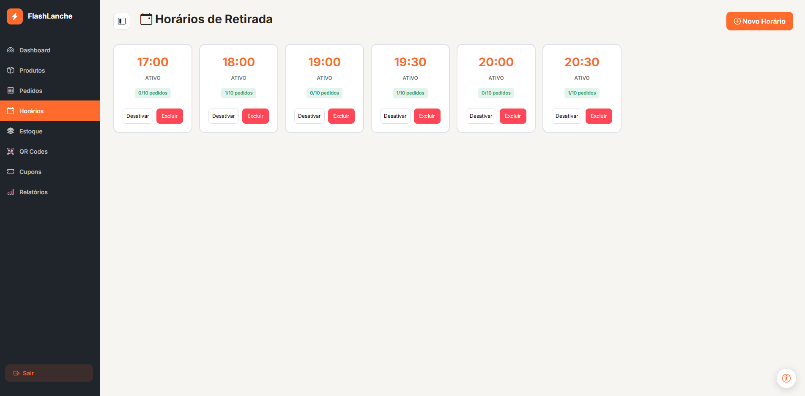

##### Funcionalidade 7 - Cadastro de Pedidos (Checkout)
Permite ao cliente finalizar o pedido selecionando um horário de retirada disponível. Os dados do cliente (nome, e-mail, telefone) são obtidos automaticamente da conta logada, sem necessidade de digitação. Ao confirmar, o pedido é registrado e um QR Code é gerado.
* **Instruções de acesso:**
  * No carrinho, clique em "Finalizar Pedido";
  * Selecione um horário de retirada disponível;
  * Clique em "Confirmar Pedido".
* **Tela da funcionalidade**:
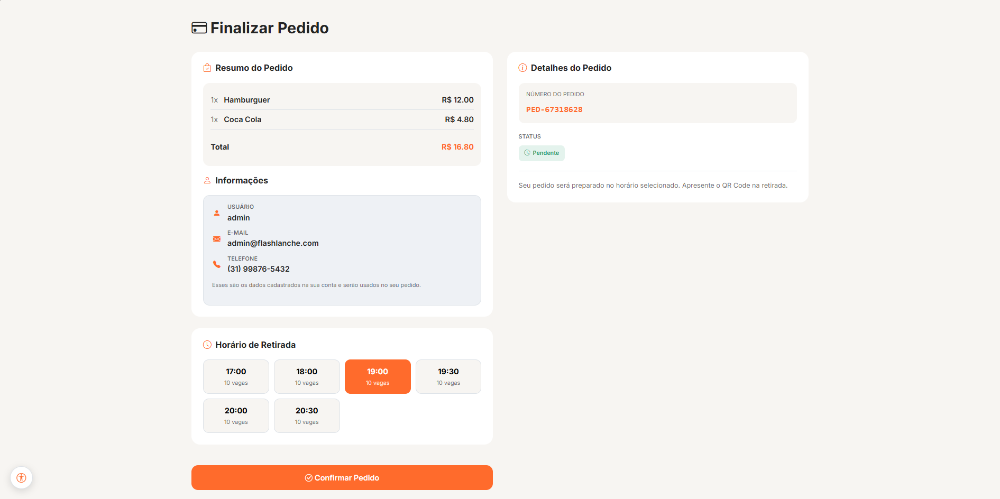

##### Funcionalidade 8 - Apresentação de Pedidos
Exibe o histórico de pedidos, com duas visões conforme o perfil: o cliente vê apenas os próprios pedidos ("Meus Pedidos"); o gerente vê todos os pedidos já registrados no sistema (via leitura de QR Code), podendo alterar o status de cada um (Pendente, Confirmado, Preparando, Pronto, Retirado, Cancelado).
* **Instruções de acesso:**
  * *Cliente:* faça login como cliente e acesse "Meus Pedidos" pela navbar;
  * *Gerente:* faça login como gerente e acesse "Pedidos" na sidebar do painel.
* **Tela da funcionalidade**:
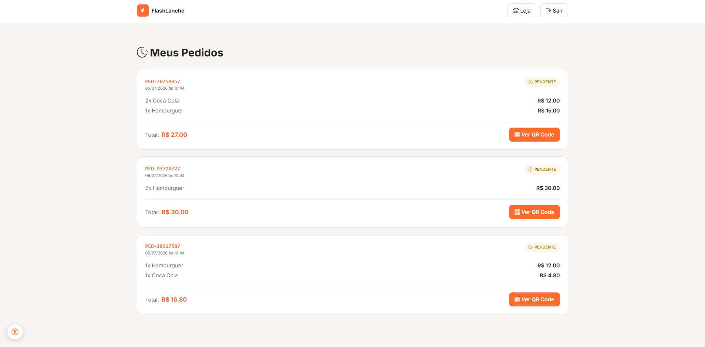
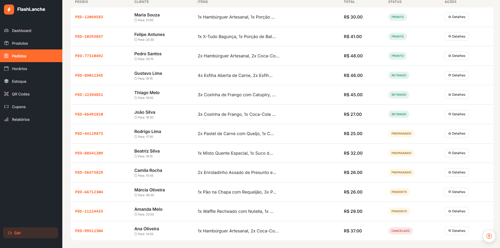

##### Funcionalidade 9 - Favoritos do Cliente
Permite ao cliente favoritar e desfavoritar produtos do cardápio, mantendo uma lista de favoritos individual por usuário, visível na tela de perfil.
* **Instruções de acesso:**
  * No cardápio, clique no ícone de coração no card do produto desejado;
  * Acesse "Meu Perfil" pela navbar para visualizar a lista de favoritos.
* **Tela da funcionalidade**:
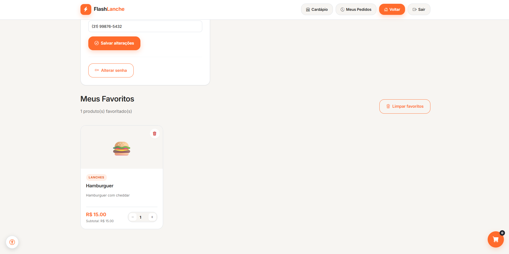

##### Funcionalidade 10 - Dashboard
Apresenta ao gerente um painel com métricas do dia (pedidos finalizados, produtos cadastrados, estoque total, receita bruta) e a fila de pedidos a caminho da retirada.
* **Instruções de acesso:**
  * Faça login como gerente;
  * A Dashboard é a página inicial do painel administrativo.
* **Tela da funcionalidade**:
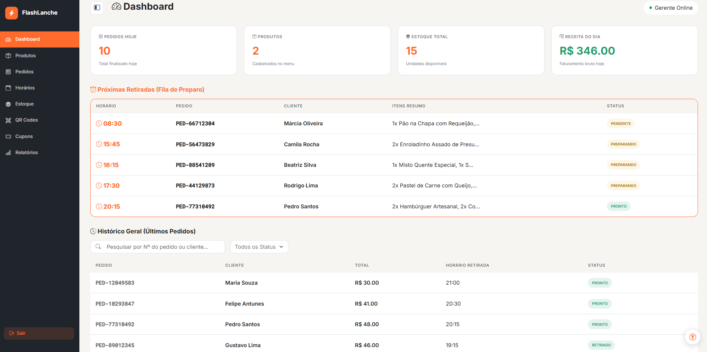

##### Funcionalidade 11 - Funcionalidade Geral do QRCode
Ao confirmar o pedido, o sistema gera um QR Code contendo os dados do pedido. O gerente lê esse QR Code (via câmera ou digitação manual) para registrar oficialmente o pedido no sistema de gestão — único ponto de entrada de um pedido no painel do gerente.
* **Instruções de acesso:**
  * *Geração:* ao final do checkout, o QR Code é exibido automaticamente em um modal;
  * *Leitura:* no painel do gerente, acesse "QR Codes" na sidebar, permita o acesso à câmera e aponte para o QR Code (ou digite o código manualmente).
* **Tela da funcionalidade**:
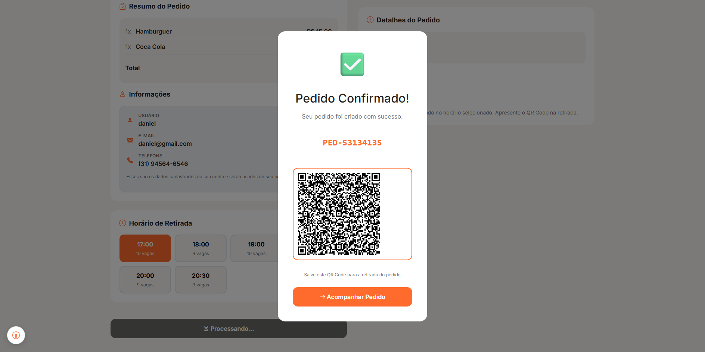
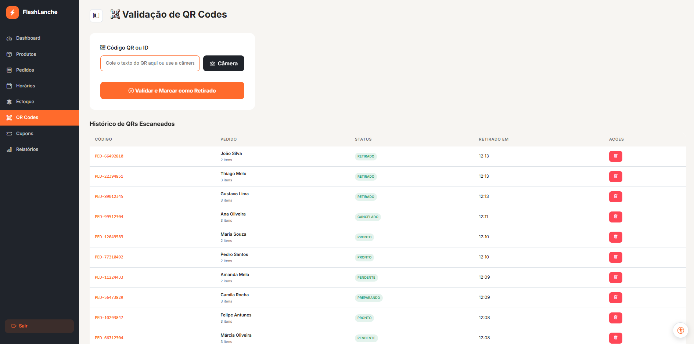

##### Funcionalidade 12 - Controle de Estoque
Permite ao gerente consultar e atualizar a quantidade em estoque de cada produto, com o status (disponível, baixo, esgotado) recalculado automaticamente a cada alteração.
* **Instruções de acesso:**
  * Faça login como gerente;
  * Acesse "Estoque" na sidebar do painel;
  * Ajuste a quantidade disponível de cada produto.
* **Tela da funcionalidade**:
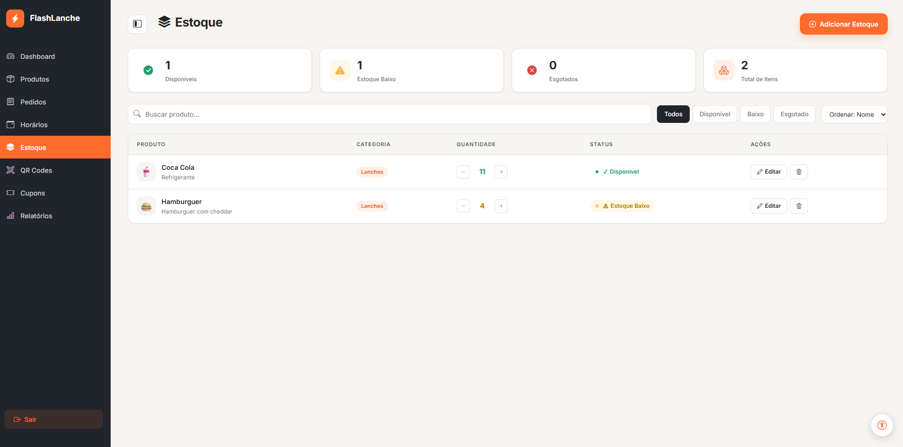

##### Funcionalidade 13 - Relatórios para o Gerente
Emite relatórios de desempenho da lanchonete (vendas, produtos mais pedidos, faturamento) com base nos pedidos registrados, filtrados por período selecionado.
* **Instruções de acesso:**
  * Faça login como gerente;
  * Acesse "Relatórios" na sidebar do painel;
  * Selecione o período desejado para visualizar os gráficos e tabelas.
* **Tela da funcionalidade**:
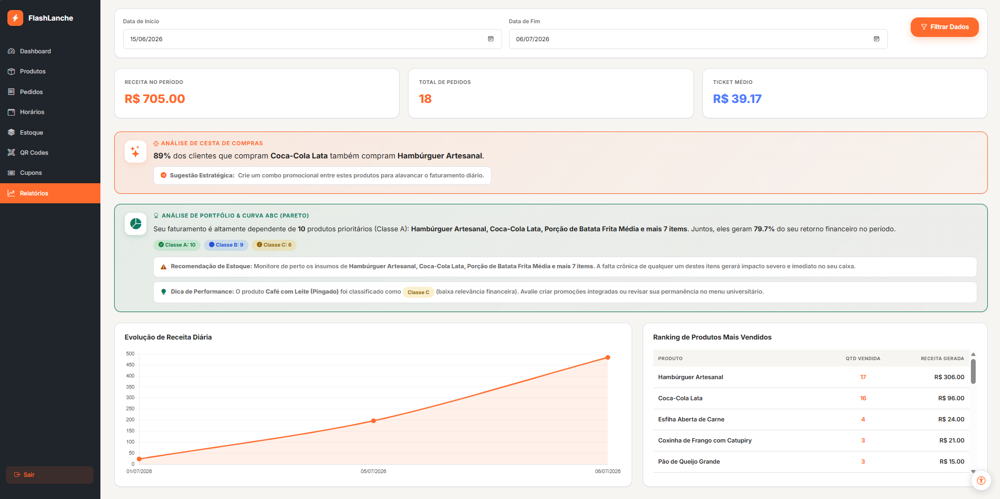

##### Funcionalidade 14 - Cadastro de Cupom
Permite ao gerente incluir, alterar e excluir cupons de desconto percentual, com código, validade e status (ativo/inativo).
* **Instruções de acesso:**
  * Faça login como gerente;
  * Acesse "Cupons" na sidebar do painel;
  * Clique em "Novo Cupom" para incluir, ou em um cupom existente para editar/excluir.
* **Tela da funcionalidade**:
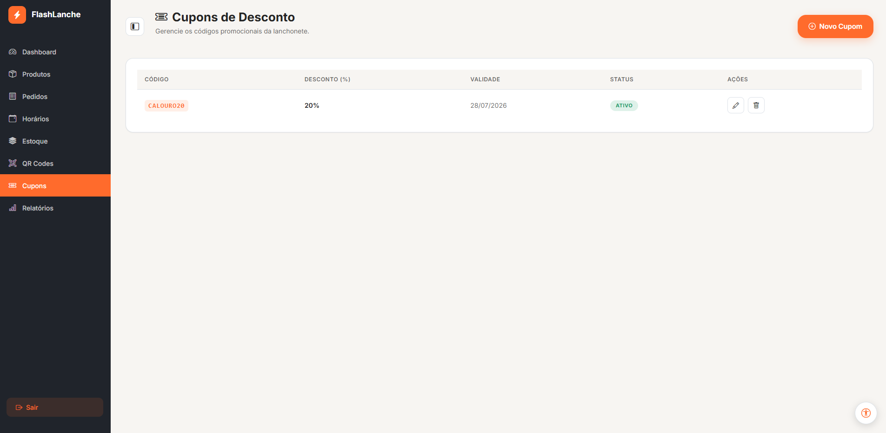

---

### Estruturas de dados

Descrição das estruturas de dados utilizadas na solução com exemplos no formato JSON. Todas as estruturas são persistidas no navegador via Web Storage API (`localStorage` para dados duradouros, `sessionStorage` para a sessão ativa), não havendo banco de dados ou backend.

##### Estrutura de dados - Usuários
Registro dos usuários do sistema (chave `users` no `localStorage`), utilizado para login, cadastro e diferenciação de perfil (RBAC).
```json
{
  "username": "user",
  "password": "123",
  "email": "user@flashlanche.com",
  "telefone": "(31) 91234-5678",
  "admin": false
}
```

##### Estrutura de dados - Sessão Ativa
Representa o usuário autenticado na aba atual (chave `activeSession` no `sessionStorage`). É apagada ao fechar a aba/navegador ou ao fazer logout.
```json
{
  "username": "user",
  "admin": false
}
```

##### Estrutura de dados - Produtos
Catálogo de produtos do cardápio (chave `produtos` no `localStorage`), compartilhado entre cliente e gerente. O campo `quantidade` representa o estoque, e `status` é calculado automaticamente a partir dele.
```json
{
  "id": "1718030000000",
  "nome": "X-Salada",
  "descricao": "Pão, hambúrguer, queijo, alface e tomate",
  "preco": 12.5,
  "categoria": "lanches",
  "imagem": "https://exemplo.com/x-salada.jpg",
  "quantidade": 8,
  "status": "baixo"
}
```

##### Estrutura de dados - Carrinho
Itens adicionados ao carrinho do cliente logado (chave `carrinho:<username>` no `localStorage`, isolada por usuário).
```json
[
  {
    "id": "1718030000000",
    "nome": "X-Salada",
    "preco": 12.5,
    "quantidade": 2
  }
]
```

##### Estrutura de dados - Favoritos
Lista de IDs de produtos favoritados pelo cliente logado (chave `favoritos:<username>` no `localStorage`, isolada por usuário).
```json
["1718030000000", "1718030050000"]
```

##### Estrutura de dados - Horários de Retirada
Horários disponíveis para retirada do pedido, com controle de capacidade (chave `horariosRetirada` no `localStorage`, compartilhada — gerenciada pelo gerente).
```json
{
  "id": 1718030100000,
  "hora": "12:00",
  "capacidade": 5,
  "pedidos": 2,
  "ativo": true
}
```

##### Estrutura de dados - Cupons
Cupons de desconto cadastrados pelo gerente (chave `cupons` no `localStorage`, compartilhada).
```json
{
  "id": "CUP-1718030200000",
  "codigo": "VOLTA10",
  "desconto": 10,
  "validade": "2026-12-31",
  "status": "Ativo"
}
```

##### Estrutura de dados - Pedidos
Representa um pedido finalizado. É criado no checkout apenas no histórico pessoal do cliente (chave `pedidos:<username>` no `localStorage`) e só passa a existir na chave compartilhada `pedidos` (usada pelo painel do gerente) quando o QR Code do pedido é lido no módulo de Validação de QR — esse é o único ponto de entrada de um pedido no sistema de gestão.
```json
{
  "id": "PED-48213",
  "usuario": "user",
  "cliente": {
    "nome": "user",
    "email": "user@flashlanche.com",
    "telefone": "(31) 91234-5678"
  },
  "itens": [
    { "id": "1718030000000", "nome": "X-Salada", "preco": 12.5, "quantidade": 2 }
  ],
  "horarioRetirada": "12:00",
  "total": 25.0,
  "status": "Pendente",
  "dataCriacao": "2026-06-10T14:32:00.000Z",
  "dataRetirada": "2026-06-10T14:45:00.000Z"
}
```

### Módulos e APIs

Esta seção apresenta os módulos e APIs utilizados na solução. Como o projeto é restrito a HTML, CSS, Bootstrap e JavaScript (sem frameworks front-end e sem backend), todos os itens abaixo são bibliotecas client-side consumidas via CDN.

**Fonts:**
* Google Fonts (Inter, Roboto Mono) - [https://fonts.google.com/](https://fonts.google.com/)
* Bootstrap Icons - [https://icons.getbootstrap.com/](https://icons.getbootstrap.com/)

**Scripts:**
* Bootstrap 5.3.3 (CSS + JS bundle) - [https://getbootstrap.com/](https://getbootstrap.com/)
* Chart.js - [https://www.chartjs.org/](https://www.chartjs.org/) — utilizado nos gráficos do Dashboard e dos Relatórios
* QRCode.js - [https://davidshimjs.github.io/qrcodejs/](https://davidshimjs.github.io/qrcodejs/) — utilizado para gerar o QR Code do pedido no checkout
* html5-qrcode - [https://github.com/mebjas/html5-qrcode](https://github.com/mebjas/html5-qrcode) — utilizado para ler o QR Code via câmera no módulo de Validação de QR

**APIs do navegador:**
* Web Storage API (`localStorage` e `sessionStorage`) — utilizada como única forma de persistência de dados da aplicação, já que o projeto não possui backend/banco de dados
* Web Speech API (`speechSynthesis`) — utilizada na funcionalidade de leitor de página (TTS)
* MediaDevices API (acesso à câmera) — utilizada pela biblioteca html5-qrcode na leitura de QR Codes

## Hospedagem

A aplicação foi hospedada na **Vercel** ([https://vercel.com/](https://vercel.com/)), plataforma de hospedagem de sites estáticos com integração contínua a repositórios Git.

Por se tratar de um projeto inteiramente client-side (HTML, CSS e JavaScript puros, sem processo de build, bundler ou backend), o processo de deploy consistiu em:

1. Conectar o repositório do projeto hospedado no GitHub) à Vercel;
2. Configurar o projeto como um site estático, sem comando de build (*Build Command* vazio) e sem diretório de saída específico, apontando diretamente para a raiz do repositório, onde está o `index.html`;
3. A Vercel realiza o deploy automaticamente a cada push na branch principal do repositório, gerando uma URL pública de produção;
4. Como não há backend nem banco de dados, não foi necessária nenhuma configuração de variáveis de ambiente, funções serverless ou banco de dados gerenciado — todo o estado da aplicação (usuários, pedidos, carrinho etc.) é mantido no navegador do próprio usuário via `localStorage`/`sessionStorage`.
